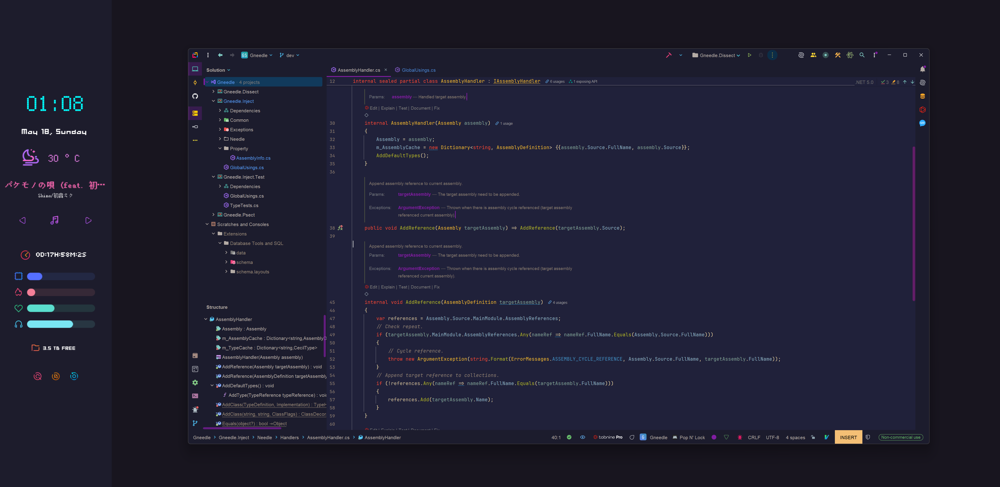
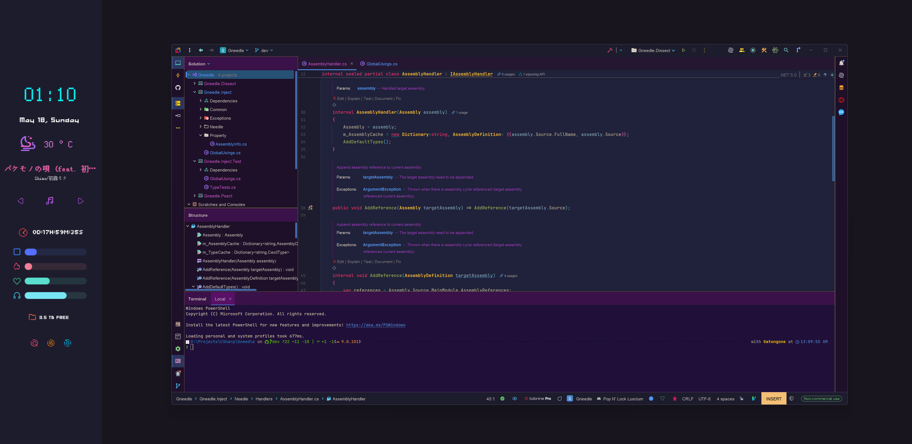

# Pop N' Lock Theme For Jetbrains IDEs

A dark theme for Jetbrains IDEs, which was inspired by [pop-n-lock-theme-vscode](https://github.com/Luxcium/pop-n-lock-theme-vscode) of [Luxcium](https://github.com/Luxcium). The theme offers two schemes of styles. One is close to Luxcium style and the other is a simpler version.

---

## Screenshot

## Install

---

**From Jetbrains Marketplace**

In your IDE, open `File/Settings` menu, find out `plugins` tab. Search for `Pop N' Lock`, then install and restart. Or you can install from [Jetbrains Marketplace](https://plugins.jetbrains.com/plugin/26241-pop-n-lock).

**From Native Jar**

Download `PopNLock.jar` from the [release pages](https://github.com/Gatongone/Pop-N-Lock-IntelliJ/releases) to your disk. In your IDE, open `File/Settings` menu, find out `Plugins`. Then click `Install Plugin from Disk`.

> More suggested installing details see: [Suggested plugins](https://www.jetbrains.com/help/idea/managing-plugins.html#suggested-plugins)

---

## License

Whatever.